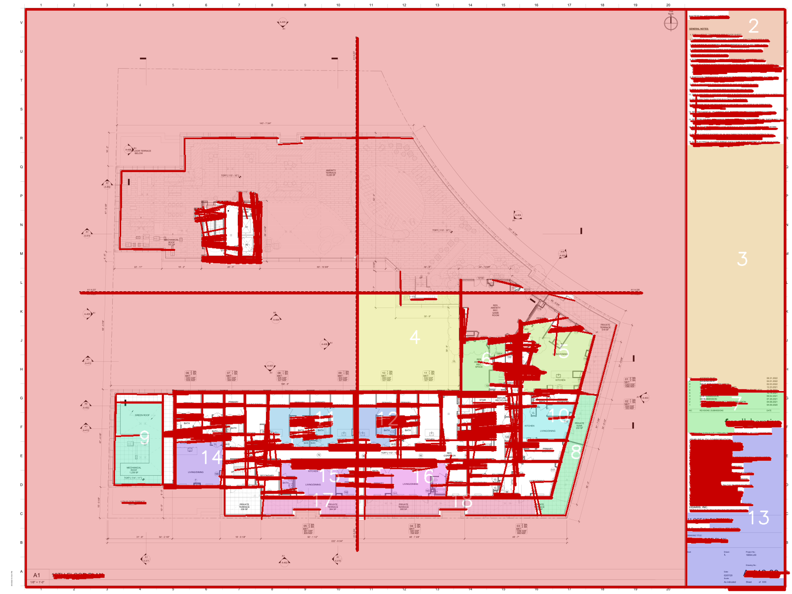

# TrueBUILT Blueprint Detector

Computer vision API for detecting walls and rooms in architectural blueprints and pre-construction plans.

## Scope delivered

| Task | Status |
|---|---|
| Wall detection (required) | ✅ Delivered |
| API server for inference (required) | ✅ Delivered |
| Room detection (optional/bonus) | ✅ Delivered |
| Fixture detection (bonus) | ⚠️ Not included — see [Known limitations](#known-limitations) |

## API response format

The `POST /detect` endpoint returns a **JSON payload** containing the annotated image embedded as a **base64-encoded PNG string** (`annotated_image_base64`), alongside metadata fields. This design avoids multipart response complexity and works cleanly with any HTTP client. To get the image file, decode the base64 string — the test script (`test_api.sh`) does this automatically and saves the PNG to `outputs/`.

---

## Approach & Methodology

### Why classical CV, not a trained model?

Architectural blueprints are a specialized domain. Off-the-shelf models (YOLO, COCO-pretrained detectors) are trained on natural images — they do not generalize to blueprint symbols, dimension lines, or hatch patterns.

Training a custom model requires a labeled dataset, which was not available within the time constraint of this assignment. A classical OpenCV pipeline was chosen because:

- It is **robust and explainable** — every step can be tuned and reasoned about
- It requires **no training data** or GPU
- It handles variability in scan quality, scale, and blueprint style
- Performance is predictable and consistent

### Pipeline

```
Input image
    │
    ▼
Preprocessing
  ├─ Grayscale conversion
  ├─ Lightweight Gaussian blur denoising
  └─ Binarization: Otsu threshold with adaptive fallback
         (fallback used when contrast is low — yellowed scans, PDFs)
    │
    ▼
Morphological cleanup
  ├─ Opening (2×2): removes isolated dots — text fragments, dimension marks
  ├─ Closing (4×4): reconnects broken wall strokes
  └─ Remove connected components < 100 px² (annotation noise)
    │
    ▼
Wall segment extraction (HoughLinesP)
  ├─ Minimum line length: 4% of shortest image dimension (scale-adaptive)
  ├─ Maximum gap: 20 px (tolerates slightly broken lines)
  └─ Angle filter: keep only horizontal (±15°) and vertical (±15°) lines
         (diagonal elements are almost always stairs, ramps, or annotations)
    │
    ▼
Wall mask rasterization
  └─ Valid segments drawn at thickness 3 → slightly fat mask
       helps seal gaps before room segmentation
    │
    ▼
Room segmentation
  ├─ Morphological closing (11×11) on wall mask → seals door openings
  ├─ Invert mask: free space becomes foreground
  ├─ Remove small free-space fragments (furniture holes, symbols)
  ├─ connectedComponentsWithStats
  ├─ Filter by area < 0.2% of image → removes symbol voids and tiny gaps
  ├─ Filter by border-touch → removes exterior region
  └─ Assign distinct HSV-spaced colors + room number labels
    │
    ▼
JSON response
  ├─ annotated_image_base64 (PNG, lossless)
  ├─ wall_segment_count
  ├─ room_count
  ├─ room_areas_px
  ├─ image dimensions
  └─ processing_time_ms
```

### Known limitations

- **Diagonal walls** are currently excluded by the angle filter. Blueprints with angled walls (e.g. hexagonal rooms) would require removing or relaxing this constraint.
- **Fixtures (doors, windows)** are not detected. Detection of blueprint-specific symbols would require either a domain-specific YOLO model (trained on annotated blueprint data) or template matching — neither was feasible within scope.
- **Wall width** is not explicitly computed. The gap-closing kernel implicitly handles varying wall thicknesses, but metric width extraction would require detecting parallel line pairs and computing their pixel distance, then mapping to scale.
- **Open floor plans** (no closed rooms) will produce zero room detections — the connected-components approach requires enclosed regions.

---

## Results on test data

> Results obtained by running the pipeline on the provided test blueprints.
> Results obtained on local CPU, with similar inference behavior confirmed through Docker validation.

| Image | Wall segments | Rooms | Processing time | Notes |
|---|---:|---:|---:|---|
| A-102 .00 - 2ND FLOOR PLAN.pdf | 1832 | 14 | 2166.29 ms | PDF real via API local after PDF downscaling + resize cap |
| A-112 .00 - 12TH FLOOR PLAN.pdf | 1039 | 18 | 1949.38 ms | PDF real via API local after PDF downscaling + resize cap |
| A0.54-FOURTH-FLOOR-REFERENCE-PLAN-Rev.1.pdf | 775 | 5 | 900.04 ms | PDF real via API local after PDF downscaling + resize cap |
| A1.02A-SECOND-FLOOR-PLAN-PART-A-Rev.3.pdf | 875 | 8 | 1511.89 ms | PDF real via API local after PDF downscaling + resize cap |

### Example annotated output



### Observations

**What works well**
- Horizontal and vertical walls in standard technical drawings are detected reliably
- Room segmentation correctly identifies enclosed regions when walls form clean boundaries
- After optimization (lighter denoising, reduced PDF render DPI, and a resize cap before detection), large real blueprint PDFs processed in a few seconds on local CPU.

**Known failure modes**
- Dense annotation areas (dimension lines, hatch patterns, text blocks) generate false positive wall segments. The morphological cleanup reduces this but does not eliminate it.
- Open floor plans or partially drawn rooms produce zero room detections — the connected-components approach requires topologically closed regions.
- Diagonal walls are excluded by the ±15° angle filter. Blueprints with angled rooms would need this constraint relaxed or removed.
- Very low-contrast scans (yellowed paper, poor PDF export) may fall back to adaptive threshold; results are slightly noisier in those cases.

**Design tradeoffs explicitly made**
- `wall_segment_count` counts Hough line segments, not consolidated architectural walls. One long wall typically produces several segments. This is a known limitation of the Hough approach.
- Door openings are sealed by the morphological closing kernel (11×11 px). Rooms connected by wide corridors may merge into a single detected region if the opening exceeds the kernel width.
- Fixture detection (doors, windows, light switches) was intentionally excluded. Off-the-shelf YOLO models trained on natural images do not generalize to blueprint symbols — detection would require a domain-specific annotated dataset, which is outside the scope of this assignment.

---


- Docker + Docker Compose (recommended)
- OR Python 3.11+ with pip

---

## Setup & Running

### Option A — Docker (recommended)

```bash
# Clone and enter the repo
git clone <your-fork-url>
cd truebuilt-ml-test

# Build and start
docker compose up --build

# API is available at http://localhost:8000

# Run the test script against a blueprint image
./test_api.sh test_data/blueprint_01.jpg
```

### Option B — Local Python

```bash
python -m venv .venv
source .venv/bin/activate       # Windows: .venv\Scripts\activate

pip install -r requirements.txt

uvicorn app.main:app --host 0.0.0.0 --port 8000 --reload
```

---

## API Reference

### `GET /demo`

Interactive web UI — open in a browser, upload a blueprint, and see the annotated result side by side with the original.

```
http://localhost:8000/demo
```

### `GET /health`

Liveness check.

```bash
curl http://localhost:8000/health
# {"status":"ok","version":"1.0.0"}
```

### `POST /detect`

Run the full detection pipeline.

**Request:** `multipart/form-data` with field `file` (image upload).

**Supported formats:** JPEG, PNG, TIFF, BMP, WebP, **PDF** (first page rendered at 110 DPI)

**Response:**

```json
{
  "annotated_image_base64": "<base64-encoded PNG>",
  "wall_segment_count": 42,
  "room_count": 5,
  "room_areas_px": [12000, 8500, 6200, 4100, 3300],
  "image_width": 1024,
  "image_height": 768,
  "processing_time_ms": 312.4
}
```

Interactive docs: [http://localhost:8000/docs](http://localhost:8000/docs)

---
## Testing


### Automated tests

```bash
pytest

---

### Manual API Test

# Make script executable (first time)
chmod +x test_api.sh

# Run against a blueprint image
./test_api.sh test_data/blueprint_01.jpg

# Custom API URL
API_URL=http://localhost:8000 ./test_api.sh path/to/your/blueprint.png
```

The script:
1. Calls `/health`
2. Calls `/detect` and prints metadata
3. Saves the annotated PNG to `outputs/`

---

### Manual curl

```bash
curl -X POST http://localhost:8000/detect \
  -F "file=@test_data/blueprint_01.jpg" \
  | python3 -c "
import sys, json, base64
d = json.load(sys.stdin)
print(f'Walls: {d[\"wall_segment_count\"]}  Rooms: {d[\"room_count\"]}  Time: {d[\"processing_time_ms\"]}ms')
open('annotated.png','wb').write(base64.b64decode(d['annotated_image_base64']))
print('Saved: annotated.png')
"
```

---

## Project Structure

```
truebuilt-ml-test/
├── app/
│   ├── main.py              # FastAPI application and /detect endpoint
│   ├── detector.py          # Wall detection pipeline (binarize → Hough → mask)
│   ├── room_segmenter.py    # Room segmentation (connected components)
│   ├── schemas.py           # Pydantic request/response models
│   └── utils.py             # Image I/O helpers (bytes ↔ cv2 ↔ base64)
├── outputs/                 # Annotated images saved by test script
├── Dockerfile
├── docker-compose.yml
├── requirements.txt
├── test_api.sh
└── README.md
```
---

## Future improvements

- Consolidate Hough line segments into higher-level architectural wall instances
- Add support for diagonal walls and more complex room geometries
- Evaluate precision/recall on a labeled blueprint dataset
- Compare the current classical CV baseline against a fine-tuned blueprint-specific detector
- Export a future learned detector to ONNX Runtime for optimized inference

---

## Tech Stack

| Library | Role |
|---|---|
| OpenCV (headless) | Core CV operations: threshold, morphology, Hough, connectedComponents |
| Pillow | Multi-format image decoding (handles TIFF, WebP, etc.) |
| NumPy | Array operations |
| FastAPI | API framework |
| Pydantic v2 | Request/response validation |
| Uvicorn | ASGI server |
| Docker | Containerization |

---

## Hybrid ML + CV Architecture

This project now supports a hybrid detection pipeline:

- **ML wall detection via ONNX Runtime** using a trained wall detector
- **Classical CV fallback** for robustness when the model is unavailable
- **Room segmentation downstream** using the wall mask as geometric structure

---

### Runtime modes

The API supports three detector modes through environment variables:

- `DETECTOR_MODE=ml` → force ML detector
- `DETECTOR_MODE=cv` → force classical OpenCV detector
- `DETECTOR_MODE=hybrid` → try ML first, fall back to CV if needed

---

### Model path

Place the exported ONNX model here:

```bash
models/wall_detector.onnx

---
